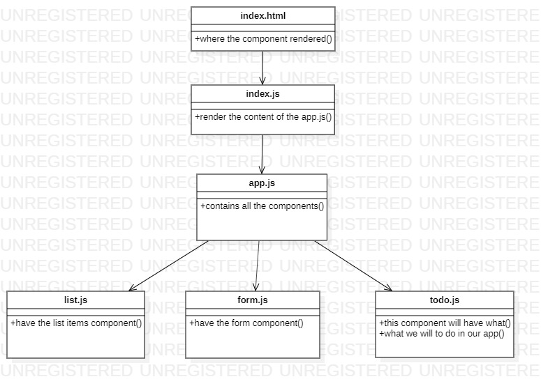

# hooks


[Lab 31](https://github.com/laith-401-advanced-javascript/todo/pull/1)


## About this repostory
```
---
In this initial phase, we’re going to have to start by converting a legacy application into a more modern architecture. Our initial “Proof of Concept” was written using class based components and was not properly styled. Now that our client has given us the “green light” for development, we’re going to refactor the application using Hooks and upgrading the style.

---
```

## Features
```
---
Number and name of feature: Notes
Estimate of time needed to complete: 2 hours 
Start time: 16:00
Finish time: 21:0
Actual time needed to complete: 3 hours
---
```


## Date published

```
---
date: 2020-9-7 10:00
---
```

## author

```
authorName : Laith Al Daree

```

## location
```
---
location: Az Zarqa-Al Azraq-Jordan
---
```

## Contact 

```
---
Email:mr.laith_2011@hotmail.com
GitHub:https://github.com/laith-2020
linkedIn :https://www.linkedin.com/in/laith-aldaree/
---
```


* if you have any quastion feel free to send me an 
  email : mr.laith_2011@hotmail.com


## UML

Link to an image of the UML for your application and response to events

lab 31 :


